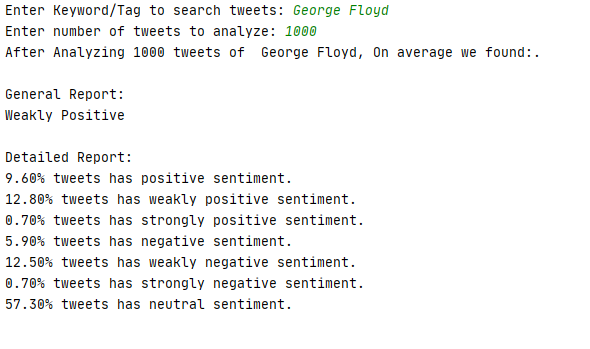

# SentiMeter_Twitter_Sentiment_Analysis
 This repository consist of a small terminal application that analyzes tweets of user given keyword and number and provides the result on their sentiment.
## Package Used:
 - TextBlob
 - Tweepy
 - Matplotlib
## Programming Language Used:
 - Python
## Screenshots:
  
